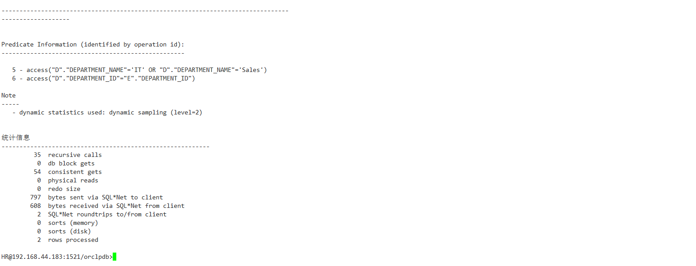
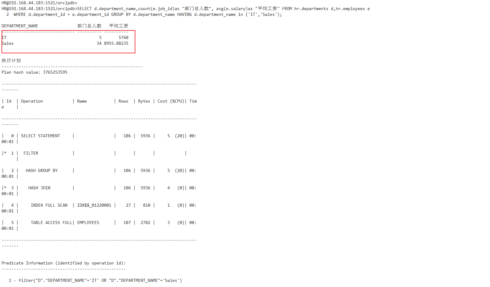
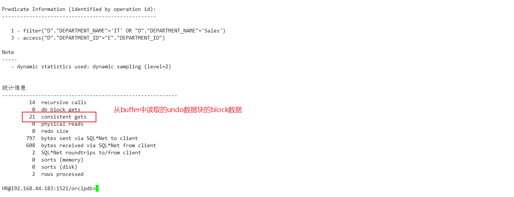

# 一、分析教材材料
### 查询一
```sql
set autotrace on

SELECT d.department_name,count(e.job_id)as "部门总人数",
avg(e.salary)as "平均工资"
from hr.departments d,hr.employees e
where d.department_id = e.department_id
and d.department_name in ('IT','Sales')
GROUP BY d.department_name;
```

#### 处理结果




### 查询二
```sql
set autotrace on

SELECT d.department_name,count(e.job_id)as "部门总人数",
avg(e.salary)as "平均工资"
FROM hr.departments d,hr.employees e
WHERE d.department_id = e.department_id
GROUP BY d.department_name
HAVING d.department_name in ('IT','Sales');
```

#### 处理结果




## 具体分析
- 从sql语句出发
这两个语句所输出的结果都是一样的，都包括字段(IT,Sales)，但是他们的执行效率不相同，语句一先使用where过滤数据，在使用group by语句对过滤之后的数据进行排序，使的在后面操作的数据会变少，而语句二则是先进行聚合函数having的使用，操作的是从数据库中查出来的原始数据，在使用where语句，明显是先刷选的所用时间较少。

- 从输出结果参数来看
对于sql语句的输出，这里需要注意的是后面数据的结果，其中比较重要的参数如下：

| 属性 | 意义 |
| ------ | ------ |
| recursice call | 递归调用的次数 |
| consistent | buffer cache中读取的undo数据的block数量 |
| redo size | DML生成的redo的大小 |

可以看出查询一中recursive calls和consistent gets都要比查询二中的好，其余的一些都是相同，所以从结果数据来看，查询一优于查询二。
2、理解having的具体含义？
简单理解就是where无法对于group by之后的数据进行搜索，筛选分组后的各族数据