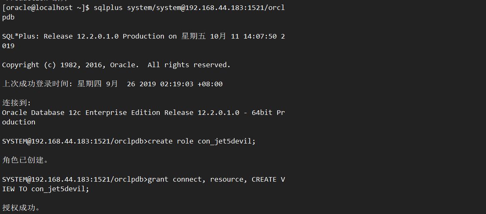
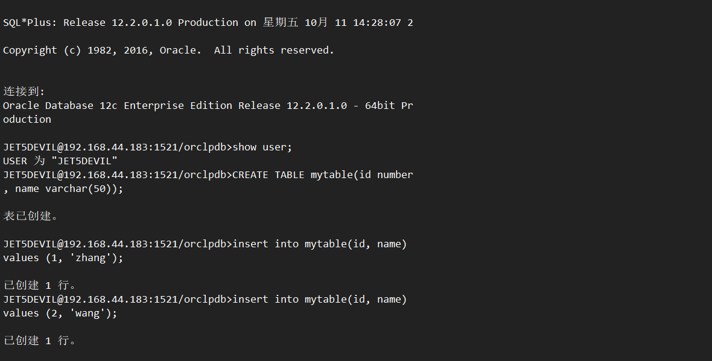

# 实验二、用户及权限管理

# 角色创建
使用system登录orclpdb中，创建角色，角色的创建主要使用的就是create role 命名，格式为`CREATE ROLE user_name;` 授权主要使用的就是`GRANT [权限,角色] TO user;` 这里我创建的用户叫做`con_jets5devil`，给它授予connect，resource 角色和create view的权限。如下是具体操作
```sql
[oracle@localhost ~]$ sqlplus system/system@192.168.44.183:1521/orclpdb

SQL*Plus: Release 12.2.0.1.0 Production on 星期五 10月 11 14:07:50 2019

Copyright (c) 1982, 2016, Oracle.  All rights reserved.
上次成功登录时间: 星期四 9月  26 2019 02:19:03 +08:00
连接到: 
Oracle Database 12c Enterprise Edition Release 12.2.0.1.0 - 64bit Production

SYSTEM@192.168.44.183:1521/orclpdb>create role con_jet5devil;
角色已创建。

SYSTEM@192.168.44.183:1521/orclpdb>grant connect, resource, CREATE VIEW TO con_jet5devil;
授权成功。
```



# 用户创建及角色分配
如上使用system登录orclpdb：创建一个jet5devil的用户，用户创建使用create role，授权使用grant，将上面创建的con_jet5devil角色的相应权限授予jet5devil。
```sql
SYSTEM@192.168.44.183:1521/orclpdb>create user jet5devil identified by jet5devil;
用户已创建。

SYSTEM@192.168.44.183:1521/orclpdb>alter user jet5devil quota 50M on users;
用户已更改。

SYSTEM@192.168.44.183:1521/orclpdb>GRANT con_jet5devil to jet5devil;
授权成功。

```


# 创建表，表空间分配
需要表空间分配之前，需要有表空间和视图等，所以使用`CREATE TABLE table_name([字段，类型]);`，表mytable中包含两个字段，id和name，分别是number和varchar类型，插入数据，insert into，在表的基础上创建试图
```sql
JET5DEVIL@192.168.44.183:1521/orclpdb>show user;
USER 为 "JET5DEVIL"
JET5DEVIL@192.168.44.183:1521/orclpdb>CREATE TABLE mytable(id number, name varchar(50));
表已创建。

JET5DEVIL@192.168.44.183:1521/orclpdb>insert into mytable(id, name) values (1, 'zhang');
已创建 1 行。

JET5DEVIL@192.168.44.183:1521/orclpdb>insert into mytable(id, name) values (2, 'wang');
已创建 1 行。

JET5DEVIL@192.168.44.183:1521/orclpdb>create view myview as select name from mytable;
视图已创建。

JET5DEVIL@192.168.44.183:1521/orclpdb>select * from myview;
NAME
--------------------------------------------------
zhang
wang

```


# 共享的设置
system登录，将试图myview授予hr（可以授予其他用户），然后使用hr账号登录数据库，查看试图，如下
```sql
JET5DEVIL@192.168.44.183:1521/orclpdb>grant select on myview to hr;
授权成功。
[oracle@localhost ~]$ sqlplus hr/hr@192.168.44.183:1521/orclpdb;    

SQL*Plus: Release 12.2.0.1.0 Production on 星期五 10月 11 14:32:09 2019
Copyright (c) 1982, 2016, Oracle.  All rights reserved.
上次成功登录时间: 星期四 9月  26 2019 00:19:33 +08:00
连接到: 
Oracle Database 12c Enterprise Edition Release 12.2.0.1.0 - 64bit Production

HR@192.168.44.183:1521/orclpdb>select *from jet5devil.myview;

NAME
--------------------------------------------------
zhang
wang
```


