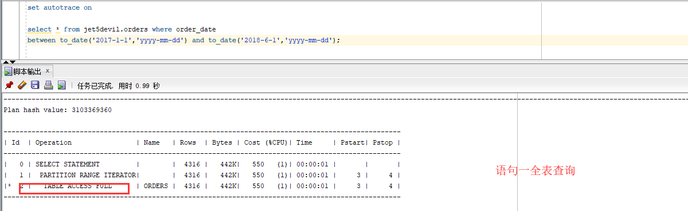

# 实验三、创建分区表
## 表空间
这里我之前已经创建了表空间USERS, USERS01, USERS02，这里不在重复创建。创建表空间user01的SQL语句如下,其他两个表空间创建类似：
```sql
CREATE TABLESPACE USERS01 
DATAFILE '/database/oracle/oracle/oradata/orcl/orclpdb/users01.dbf' 
SIZE 100M AUTOEXTEND ON NEXT 50M MAXSIZE UNLIMITED 
EXTENT MANAGEMENT LOCAL SEGMENT SPACE MANAGEMENT AUTO;
```
查询表空间语句和结果如下：
```sql
JET5DEVIL@192.168.44.183:1521/orclpdb>select tablespace_name from dba_data_files order by tablespace_name;

TABLESPACE_NAME
------------------------------
EXAMPLE
HR
SYSAUX
SYSTEM
UNDOTBS1
USERS
USERS02
USERS03

已选择 8 行。

```
## 授权给用户jet5devil
将表空间USERS, USERS02, USERS03不受限制的授权给jet5devil，SQL语句如下：
```sql
SYSTEM@192.168.44.183:1521/orclpdb>ALTER USER jet5devil QUOTA UNLIMITED ON USERS;

用户已更改。

SYSTEM@192.168.44.183:1521/orclpdb>ALTER USER jet5devil QUOTA UNLIMITED ON USERS02;

用户已更改。

SYSTEM@192.168.44.183:1521/orclpdb>ALTER USER jet5devil QUOTA UNLIMITED ON USERS03;

用户已更改。
```


## 表创建和分区策略设计
这里创建了两个表，一个叫做orders， 一个叫order_details。我这里使用的一个sql文件，使用`@sql文件名.sql`，来执行语句,下面的输出是一些详细信息；
### ORDERS  表创建语句
```sql
CREATE TABLE ORDERS
(
  ORDER_ID NUMBER(10, 0) NOT NULL
, CUSTOMER_NAME VARCHAR2(40 BYTE) NOT NULL
, CUSTOMER_TEL VARCHAR2(40 BYTE) NOT NULL
, ORDER_DATE DATE NOT NULL
, EMPLOYEE_ID NUMBER(6, 0) NOT NULL
, DISCOUNT NUMBER(8, 2) DEFAULT 0
, TRADE_RECEIVABLE NUMBER(8, 2) DEFAULT 0
, CONSTRAINT ORDERS_PK PRIMARY KEY
  (
    ORDER_ID
  )
  USING INDEX
  (
      CREATE UNIQUE INDEX ORDERS_PK ON ORDERS (ORDER_ID ASC)
      LOGGING
      TABLESPACE USERS
      PCTFREE 10
      INITRANS 2
      STORAGE
      (
        BUFFER_POOL DEFAULT
      )
      NOPARALLEL
  )
  ENABLE
)
TABLESPACE USERS
PCTFREE 10
INITRANS 1
STORAGE
(
  BUFFER_POOL DEFAULT
)
NOCOMPRESS
NOPARALLEL
PARTITION BY RANGE (ORDER_DATE)
(
  PARTITION PARTITION_2015 VALUES LESS THAN (TO_DATE(' 2016-01-01 00:00:00', 'SYYYY-MM-DD HH24:MI:SS', 'NLS_CALENDAR=GREGORIAN'))
  NOLOGGING
  TABLESPACE USERS
  PCTFREE 10
  INITRANS 1
  STORAGE
  (
    INITIAL 8388608
    NEXT 1048576
    MINEXTENTS 1
    MAXEXTENTS UNLIMITED
    BUFFER_POOL DEFAULT
  )
  NOCOMPRESS NO INMEMORY
, PARTITION PARTITION_2016 VALUES LESS THAN (TO_DATE(' 2017-01-01 00:00:00', 'SYYYY-MM-DD HH24:MI:SS', 'NLS_CALENDAR=GREGORIAN'))
  NOLOGGING
  TABLESPACE USERS
  PCTFREE 10
  INITRANS 1
  STORAGE
  (
    BUFFER_POOL DEFAULT
  )
  NOCOMPRESS NO INMEMORY
, PARTITION PARTITION_2017 VALUES LESS THAN (TO_DATE(' 2018-01-01 00:00:00', 'SYYYY-MM-DD HH24:MI:SS', 'NLS_CALENDAR=GREGORIAN'))
  NOLOGGING
  TABLESPACE USERS
  PCTFREE 10
  INITRANS 1
  STORAGE
  (
    BUFFER_POOL DEFAULT
  )
  NOCOMPRESS NO INMEMORY
, PARTITION PARTITION_2018 VALUES LESS THAN (TO_DATE(' 2019-01-01 00:00:00', 'SYYYY-MM-DD HH24:MI:SS', 'NLS_CALENDAR=GREGORIAN'))
  NOLOGGING
  TABLESPACE USERS02
  PCTFREE 10
  INITRANS 1
  STORAGE
  (
    BUFFER_POOL DEFAULT
  )
  NOCOMPRESS NO INMEMORY
, PARTITION PARTITION_2019 VALUES LESS THAN (TO_DATE(' 2020-01-01 00:00:00', 'SYYYY-MM-DD HH24:MI:SS', 'NLS_CALENDAR=GREGORIAN'))
  NOLOGGING
  TABLESPACE USERS02
  PCTFREE 10
  INITRANS 1
  STORAGE
  (
    BUFFER_POOL DEFAULT
  )
  NOCOMPRESS NO INMEMORY
, PARTITION PARTITION_2020 VALUES LESS THAN (TO_DATE(' 2021-01-01 00:00:00', 'SYYYY-MM-DD HH24:MI:SS', 'NLS_CALENDAR=GREGORIAN'))
  NOLOGGING
  TABLESPACE USERS02
  PCTFREE 10
  INITRANS 1
  STORAGE
  (
    BUFFER_POOL DEFAULT
  )
  NOCOMPRESS NO INMEMORY
, PARTITION PARTITION_2021 VALUES LESS THAN (TO_DATE(' 2022-01-01 00:00:00', 'SYYYY-MM-DD HH24:MI:SS', 'NLS_CALENDAR=GREGORIAN'))
  NOLOGGING
  TABLESPACE USERS03
  PCTFREE 10
  INITRANS 1
  STORAGE
  (
    BUFFER_POOL DEFAULT
  )
  NOCOMPRESS NO INMEMORY
);
```
### ORDER_DETAILS 表创建语句
```sql
CREATE TABLE order_details
(
id NUMBER(10, 0) NOT NULL
, order_id NUMBER(10, 0) NOT NULL
, product_name VARCHAR2(40 BYTE) NOT NULL
, product_num NUMBER(8, 2) NOT NULL
, product_price NUMBER(8, 2) NOT NULL
, CONSTRAINT order_details_fk1 FOREIGN KEY  (order_id)
REFERENCES orders  (  order_id   )
ENABLE
)
TABLESPACE USERS
PCTFREE 10 INITRANS 1
STORAGE (BUFFER_POOL DEFAULT )
NOCOMPRESS NOPARALLEL
PARTITION BY REFERENCE (order_details_fk1);
```
### 分区策略设计语句
```sql
begin
/*
system login:
ALTER USER "TEACHER" QUOTA UNLIMITED ON USERS;
ALTER USER "TEACHER" QUOTA UNLIMITED ON USERS02;
ALTER USER "TEACHER" QUOTA UNLIMITED ON USERS03;
*/
  v_order_detail_id:=1;
  delete from order_details;
  delete from orders;
  for i in 1..10000
  loop
    if i mod 6 =0 then
      dt:=to_date('2015-3-2','yyyy-mm-dd')+(i mod 60); --PARTITION_2015
    elsif i mod 6 =1 then
      dt:=to_date('2016-3-2','yyyy-mm-dd')+(i mod 60); --PARTITION_2016
    elsif i mod 6 =2 then
      dt:=to_date('2017-3-2','yyyy-mm-dd')+(i mod 60); --PARTITION_2017
    elsif i mod 6 =3 then
      dt:=to_date('2018-3-2','yyyy-mm-dd')+(i mod 60); --PARTITION_2018
    elsif i mod 6 =4 then
      dt:=to_date('2019-3-2','yyyy-mm-dd')+(i mod 60); --PARTITION_2019
    else
      dt:=to_date('2020-3-2','yyyy-mm-dd')+(i mod 60); --PARTITION_2020
    end if;
    V_EMPLOYEE_ID:=CASE I MOD 6 WHEN 0 THEN 11 WHEN 1 THEN 111 WHEN 2 THEN 112
                                WHEN 3 THEN 12 WHEN 4 THEN 121 ELSE 122 END;
    --插入订单
    v_order_id:=i;
    v_name := 'aa'|| 'aa';
    v_name := 'zhang' || i;
    v_tel := '139888883' || i;
    insert /*+append*/ into ORDERS (ORDER_ID,CUSTOMER_NAME,CUSTOMER_TEL,ORDER_DATE,EMPLOYEE_ID,DISCOUNT)
      values (v_order_id,v_name,v_tel,dt,V_EMPLOYEE_ID,dbms_random.value(100,0));
    --插入订单y一个订单包括3个产品
    v:=dbms_random.value(10000,4000);
    v_name:='computer'|| (i mod 3 + 1);
    insert /*+append*/ into ORDER_DETAILS(ID,ORDER_ID,PRODUCT_NAME,PRODUCT_NUM,PRODUCT_PRICE)
      values (v_order_detail_id,v_order_id,v_name,2,v);
    v:=dbms_random.value(1000,50);
    v_name:='paper'|| (i mod 3 + 1);
    v_order_detail_id:=v_order_detail_id+1;
    insert /*+append*/ into ORDER_DETAILS(ID,ORDER_ID,PRODUCT_NAME,PRODUCT_NUM,PRODUCT_PRICE)
      values (v_order_detail_id,v_order_id,v_name,3,v);
    v:=dbms_random.value(9000,2000);
    v_name:='phone'|| (i mod 3 + 1);

    v_order_detail_id:=v_order_detail_id+1;
    insert /*+append*/ into ORDER_DETAILS(ID,ORDER_ID,PRODUCT_NAME,PRODUCT_NUM,PRODUCT_PRICE)
      values (v_order_detail_id,v_order_id,v_name,1,v);
    --在触发器关闭的情况下，需要手工计算每个订单的应收金额：
    select sum(PRODUCT_NUM*PRODUCT_PRICE) into m from ORDER_DETAILS where ORDER_ID=v_order_id;
    if m is null then
     m:=0;
    end if;
    UPDATE ORDERS SET TRADE_RECEIVABLE = m - discount WHERE ORDER_ID=v_order_id;
    IF I MOD 1000 =0 THEN
      commit; --每次提交会加快插入数据的速度
    END IF;
  end loop;
end;
```
### 所有语句执行结果
```sql
JET5DEVIL@192.168.44.183:1521/orclpdb>@/home/oracle/source/test3.sql

PL/SQL 过程已成功完成。


表已创建。

表已创建。

PL/SQL 过程已成功完成。

  COUNT(*)
----------
     10000

执行计划
----------------------------------------------------------
Plan hash value: 134135270

---------------------------------------------------------------------------
| Id  | Operation	      | Name	  | Rows  | Cost (%CPU)| Time	  |
---------------------------------------------------------------------------
|   0 | SELECT STATEMENT      | 	  |	1 |    11   (0)| 00:00:01 |
|   1 |  SORT AGGREGATE       | 	  |	1 |	       |	  |
|   2 |   INDEX FAST FULL SCAN| ORDERS_PK | 28592 |    11   (0)| 00:00:01 |
---------------------------------------------------------------------------

Note
-----
   - dynamic statistics used: dynamic sampling (level=2)

统计信息
----------------------------------------------------------
	  7  recursive calls
	  0  db block gets
	185  consistent gets
	  0  physical reads
	140  redo size
	550  bytes sent via SQL*Net to client
	608  bytes received via SQL*Net from client
	  2  SQL*Net roundtrips to/from client
	  0  sorts (memory)
	  0  sorts (disk)
	  1  rows processed

  COUNT(*)
----------
     30000

执行计划
----------------------------------------------------------
Plan hash value: 1955519159

--------------------------------------------------------------------------------

| Id  | Operation		 | Name 	 | Rows  | Cost (%CPU)| Time
 | Pstart| Pstop |

--------------------------------------------------------------------------------

|   0 | SELECT STATEMENT	 |		 |     1 |  1638   (1)| 00:00:01
 |	 |	 |

|   1 |  SORT AGGREGATE 	 |		 |     1 |	      |
 |	 |	 |

|   2 |   PARTITION REFERENCE ALL|		 | 52100 |  1638   (1)| 00:00:01
 |     1 |     7 |

|   3 |    TABLE ACCESS FULL	 | ORDER_DETAILS | 52100 |  1638   (1)| 00:00:01
 |     1 |     7 |

--------------------------------------------------------------------------------
Note
-----
   - dynamic statistics used: dynamic sampling (level=2)

统计信息
----------------------------------------------------------
	 12  recursive calls
	  0  db block gets
	650  consistent gets
	  0  physical reads
	  0  redo size
	550  bytes sent via SQL*Net to client
	608  bytes received via SQL*Net from client
	  2  SQL*Net roundtrips to/from client
	  2  sorts (memory)
	  0  sorts (disk)
	  1  rows processed
```

## 执行计划
比较以下两条语句的执行计划
### 语句一
```sql
set autotrace on

select * from jet5devil.orders where order_date
between to_date('2017-1-1','yyyy-mm-dd') and to_date('2018-6-1','yyyy-mm-dd');
```

### 语句二
```sql
set autotrace on

select a.ORDER_ID,a.CUSTOMER_NAME,
b.product_name,b.product_num,b.product_price
from jet5devil.orders a,jet5devil.order_details b where
a.ORDER_ID=b.order_id and
a.order_date between to_date('2017-1-1','yyyy-mm-dd') and to_date('2018-6-1','yyyy-mm-dd');
```

#### 分析
语句一直接从orders表中取出在2017-1-1到2018-6-1之间的数据

语句二使用order_id先关联orders和order_details两个表，再从满足的条件中选取数据在2017-1-1到2018-6-1之间的数据，这样选择的数据可以大大减少，不像语句一，是在所有的数据中进行查找。
